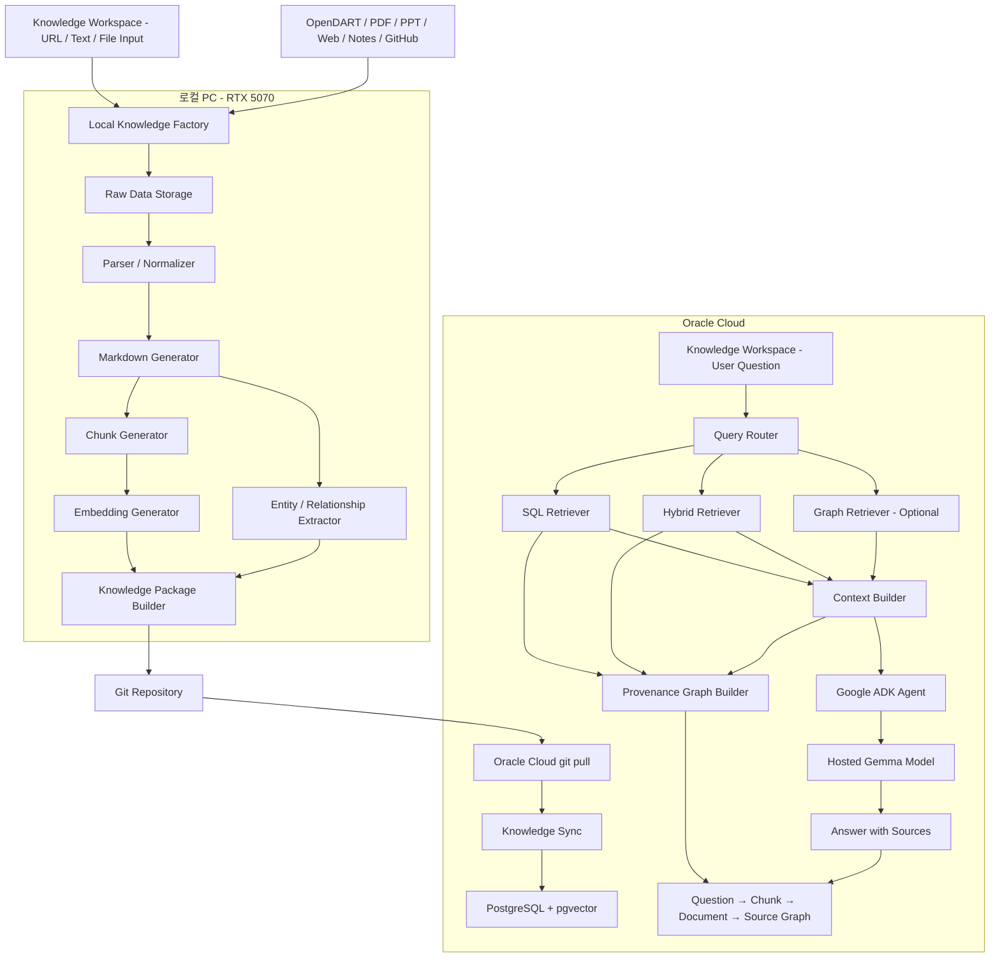

# Personal Second-Brain 프로젝트 설계서

## 1. 프로젝트 개요

이 프로젝트의 목적은 다양한 지식 원본을 로컬 PC에서 수집·정리하여 개인용 지식베이스를 구축하고, Oracle Cloud에 배포된 검색 서버와 Google ADK 기반 LLM 에이전트를 통해 자연어로 질의할 수 있는 **개인용 Second-Brain 시스템**을 만드는 것이다.

Second-Brain은 단순히 Markdown 파일을 검색하는 시스템이 아니다.

다음 기능을 하나의 질의 인터페이스로 제공하는 것을 목표로 한다.

* OpenDART 기업 재무제표 검색 및 요약
* 기술 문서, PDF, 웹 문서 검색
* 개발 프로젝트 기록 및 문제 해결 이력 검색
* 개인 메모와 의사결정 기록 검색
* 시간, 프로젝트, 출처, 문서 유형을 고려한 검색
* 검색된 근거를 이용한 LLM 답변 생성
* 답변에 사용된 출처 표시
* URL, 텍스트, PDF, PPT 자료를 등록하는 Knowledge Workspace
* 질문이 참고한 Chunk, 문서, 원본을 연결해서 보여주는 출처 그래프
* 향후 지식 그래프 기반 관계 검색 확장

---

# 2. 핵심 의도

전체 시스템은 다음 세 가지 환경으로 나뉜다.

```text
로컬 PC
= 지식을 생산하는 공장

Git
= 생산된 지식과 코드를 전달하는 배포 채널

Oracle Cloud
= 항상 실행되는 검색 및 질의 서버
```

최종 답변은 Oracle Cloud에서 실행되는 Google ADK 에이전트가 생성한다.

Google ADK는 검색 도구를 호출하여 필요한 문맥을 가져오고, Google에서 제공하는 Gemma 계열 모델을 이용해 답변을 생성한다.

---

# 3. 전체 아키텍처



---

# 4. 환경별 역할

## 4.1 로컬 PC

환경:

* Windows + WSL
* NVIDIA RTX 5070
* Ollama
* Python 3.12
* Git

로컬 PC는 연산량이 큰 작업을 담당한다.

### 담당 작업

* OpenDART API 데이터 수집
* URL, PDF, PPT, 웹페이지, Markdown, 텍스트 파일 수집
* 로컬 Knowledge Workspace를 통한 자료 등록
* 원본 파일 보관
* 문서 파싱 및 정규화
* Ollama 모델을 이용한 요약
* 태그 추출
* 엔티티 및 관계 추출
* Markdown Wiki 생성
* Chunk 생성
* 문서 Embedding 생성
* Graphify 그래프 생성
* Oracle 배포용 지식 패키지 생성
* Manifest 생성
* Git push

### 로컬에만 보관할 데이터

다음 데이터는 Git에 올리지 않는다.

```text
raw/
├─ opendart/
├─ pdf/
├─ web/
├─ xbrl/
└─ private/
```

포함되는 데이터 예시:

* OpenDART 원본 JSON
* XBRL ZIP
* PDF 원본
* 웹페이지 원문
* API 응답 캐시
* Ollama 모델
* 개인정보가 포함된 원본
* API Key
* 임시 파일
* 모델 캐시

---

## 4.2 Git Repository

Git은 원본 데이터 저장소가 아니라 **재생성 가능한 지식 결과물과 코드의 배포 채널**이다.

### Git에 포함할 항목

```text
app/
scripts/
migrations/
knowledge/
metadata/
manifests/
graphs/
prompts/
deploy/
tests/
pyproject.toml
docker-compose.yml
.env.example
```

초기 규모가 작을 때는 다음 데이터도 Git에 포함할 수 있다.

```text
artifacts/
├─ chunks.jsonl.gz
├─ embeddings.parquet
└─ financial_facts.jsonl.gz
```

Embedding 파일이나 지식 패키지가 지나치게 커질 경우에는 Git에 직접 커밋하지 않고 다음 방식으로 이전한다.

* GitHub Release
* OCI Object Storage
* 별도 Artifact 저장소
* rsync 또는 scp

Git에는 해당 배포 파일의 위치와 checksum이 기록된 manifest만 저장한다.

---

## 4.3 Oracle Cloud

Oracle Cloud는 항상 실행되는 Second-Brain 서버다.

### 담당 작업

* Git pull
* 신규 지식 패키지 감지
* PostgreSQL 데이터 upsert
* pgvector embedding upsert
* 삭제 문서 비활성화
* 사용자 질문 수신
* 사용자 질문 embedding
* Metadata filter
* Keyword 검색
* Vector 검색
* SQL 기반 정형 데이터 조회
* 검색 결과 조합
* Google ADK 에이전트 실행
* Gemma 모델을 이용한 답변 생성
* 답변 출처 반환
* 질문별 provenance graph 생성
* 질문, 출처, 그래프 탐색을 위한 Knowledge Workspace 제공

Oracle Cloud에서는 대형 로컬 LLM을 실행하지 않는다.

Oracle Cloud는 검색과 API에 집중하고 최종 답변 생성은 Google ADK를 통해 호스팅된 Gemma 모델에 요청한다.

Knowledge Workspace는 동일한 프론트엔드 코드베이스를 사용하되 환경별 기능을 분리한다.

* 로컬 실행: URL, 텍스트, PDF, PPT 등록과 처리 상태 확인
* Oracle 실행: 동기화된 지식에 대한 질문, 답변, 출처 그래프 탐색

원본 PDF와 PPT를 Oracle에 업로드하여 처리하지 않는다. 원본 입력과 무거운 파싱은 로컬 Knowledge Factory에서 수행하고, Oracle에는 정규화된 문서와 검색 인덱스만 전달한다.

---

# 5. 기술 스택

## 공통

* Python 3.12
* uv
* Pydantic v2
* pytest
* Ruff
* Docker Compose

## Backend

* FastAPI
* SQLAlchemy 2.x Async
* asyncpg
* Alembic
* PostgreSQL
* pgvector
* PostgreSQL Full Text Search
* pg_trgm

## 로컬 LLM

* Ollama
* Gemma 계열 모델
* Embedding 전용 모델

## Oracle 답변 생성

* Google ADK
* Google API Key
* 호스팅된 Gemma 계열 모델

모델 이름은 코드에 하드코딩하지 않고 환경변수로 설정한다.

```env
ADK_MODEL_NAME=gemma-4-26b-a4b-it
```

사용 가능한 모델이나 무료 한도는 변경될 수 있으므로 모델 Provider를 교체할 수 있는 구조로 작성한다.

---

# 6. 중요 설계 원칙

## 6.1 Markdown은 사실 데이터베이스가 아니다

Markdown은 사람이 읽기 좋고 LLM이 검색하기 좋은 파생 데이터다.

정확한 숫자, 날짜, 상태값은 PostgreSQL에 저장해야 한다.

예:

```text
삼성전자의 가장 최근 연결 영업이익은?
```

이 질문은 Vector 검색만으로 답하지 않는다.

먼저 PostgreSQL에서 다음 정보를 확정한다.

* 기업
* 보고서
* 보고서 접수일
* 사업연도
* 분기
* 연결 또는 별도
* 정정 여부
* 영업이익

그 후 관련 설명과 문맥만 Vector 검색으로 보완한다.

---

## 6.2 원본, 지식 문서, 검색 인덱스를 분리한다

```text
원본
→ 파싱과 재처리를 위한 데이터

지식 문서
→ 사람이 읽고 Git으로 관리하는 Markdown

검색 인덱스
→ RAG 검색을 위한 Chunk와 Embedding

그래프
→ 엔티티 관계 검색을 위한 파생 데이터
```

각 데이터는 서로 대체하지 않는다.

---

## 6.3 로컬과 Oracle은 동일한 Embedding 모델을 사용한다

로컬에서 문서 Embedding을 만들고 Oracle에서 사용자 질문 Embedding을 만든다.

두 환경은 반드시 다음 설정이 같아야 한다.

```yaml
embedding:
  provider: ollama
  model: bge-m3
  dimensions: 1024
  normalize: true
  chunker_version: 1
  embedding_version: 1
```

서로 다른 모델로 생성된 문서 벡터와 질문 벡터를 비교하면 안 된다.

Oracle에서 해당 Embedding 모델의 실행 성능이 부족하면 다음 절차를 따른다.

1. 더 작은 다국어 Embedding 모델을 선정한다.
2. 로컬 문서 전체를 새 모델로 다시 Embedding한다.
3. Oracle 질문 Embedding도 동일 모델로 교체한다.
4. 기존 Vector Index를 재생성한다.

기존 벡터와 신규 모델 벡터를 혼합하지 않는다.

---

## 6.4 답변은 검색된 근거 안에서만 생성한다

Google ADK의 Gemma 에이전트는 검색 도구가 반환한 문맥만 사용한다.

검색되지 않은 사실을 모델의 일반 지식으로 단정하지 않는다.

문맥이 부족하면 다음처럼 응답한다.

```text
현재 Second-Brain에 저장된 자료만으로는 답변할 근거가 부족합니다.
```

---

## 6.5 모든 답변에는 출처를 포함한다

각 Chunk는 원본 문서를 추적할 수 있어야 한다.

최소 출처 정보:

* 문서 제목
* 문서 ID
* 파일 경로 또는 원본 URL
* 작성일
* 수정일
* 섹션
* OpenDART 접수번호
* 프로젝트명
* Chunk ID

답변 예시:

```text
삼성전자의 최근 연결 재무제표에서는 매출과 영업이익이 다음과 같이 나타났습니다.

...

출처:
- 삼성전자 2026년 1분기 연결재무제표
- OpenDART 접수번호: 2026XXXXXXXX
- 섹션: 손익계산서
```

---

# 7. 지식 분류

Second-Brain에 저장되는 지식은 다음 네 종류로 나눈다.

## 7.1 정형 사실

예:

* OpenDART 재무제표
* 주식 가격
* 시장 지표
* 환율
* 금리
* 프로젝트 상태
* 일정
* 정량적인 실험 결과

저장:

```text
PostgreSQL 정형 테이블
```

검색:

```text
SQL Retriever
```

---

## 7.2 비정형 문서

예:

* PDF
* 기술 문서
* 웹페이지
* 뉴스
* 매뉴얼
* 블로그
* 보고서
* Markdown

저장:

```text
Markdown + Chunk + Embedding
```

검색:

```text
Hybrid Retriever
```

---

## 7.3 개인 기록 및 프로젝트 지식

예:

* 개발 문제 해결 기록
* 프로젝트 설계
* 의사결정
* 장애 대응 기록
* 회의 메모
* 학습 노트
* TODO 결과

저장:

```text
Markdown + Metadata + Embedding
```

중요 Metadata:

* project
* domain
* created_at
* updated_at
* decision_status
* tags
* entities

---

## 7.4 관계 정보

예:

```text
trading-api --uses--> FastAPI
investment-agent --reads--> trading-api
삼성전자 --reported_in--> 사업보고서
사업보고서 --contains--> 연결재무제표
```

저장:

```text
Graphify graph.json 또는 별도 관계 테이블
```

Graph 검색은 초기 MVP에 필수는 아니다.

Graphify는 문서 검색과 SQL 검색이 안정화된 후 추가한다.

---

# 8. 공통 문서 Metadata

모든 Markdown 문서는 YAML front matter를 가진다.

```yaml
---
id: "project-oracle-adk-connection-20260722"
title: "Oracle Cloud ADK 접속 문제 해결"
source_type: "personal_note"
document_type: "troubleshooting"
domain: "development"
project: "investment-agents"
language: "ko"
created_at: "2026-07-22T12:00:00+09:00"
updated_at: "2026-07-22T15:30:00+09:00"
observed_at: "2026-07-22T15:30:00+09:00"
valid_from: null
valid_to: null
tags:
  - oracle-cloud
  - google-adk
  - fastapi
entities:
  - Oracle Cloud
  - Google ADK
access_scope: "private"
llm_policy: "external_allowed"
content_version: 1
content_hash: "sha256:..."
---
```

## 필수 Metadata

* `id`
* `title`
* `source_type`
* `document_type`
* `domain`
* `created_at`
* `updated_at`
* `observed_at`
* `tags`
* `access_scope`
* `llm_policy`
* `content_version`
* `content_hash`

## 날짜 필드 의미

* `created_at`: 원본 작성일
* `updated_at`: 원본 수정일
* `observed_at`: Second-Brain 수집일
* `valid_from`: 사실이 유효해진 시점
* `valid_to`: 사실이 유효하지 않게 된 시점

---

# 9. 접근 권한과 외부 LLM 정책

Google ADK의 Gemma 모델에는 외부 전송이 허용된 문맥만 전달한다.

각 문서는 다음 정책 중 하나를 가진다.

```yaml
llm_policy: external_allowed
```

또는:

```yaml
llm_policy: local_only
```

## `external_allowed`

Google ADK를 통한 답변 생성 가능.

예:

* 공개 기술 문서
* OpenDART 공시
* 공개 웹 문서
* 비민감 프로젝트 설명

## `local_only`

외부 모델로 전송하지 않는다.

예:

* 회사 내부 문서
* 계좌번호
* 계약서
* 개인정보
* 민감한 개인 기록
* API Key
* 인증 정보

Oracle에서 검색 결과에 `local_only` 문서가 포함되면 외부 Gemma 모델에 전달하지 않는다.

초기 MVP에서는 다음과 같이 응답해도 된다.

```text
관련 자료는 존재하지만 local_only 정책으로 인해 외부 모델을 통한 답변을 생성할 수 없습니다.
```

향후 로컬 Ollama 모델 라우팅을 추가한다.

---

# 10. 데이터베이스 모델

## 10.1 sources

```text
id
source_type
name
base_uri
metadata
created_at
updated_at
```

---

## 10.2 documents

```text
id
source_id
source_key
title
document_type
domain
project
language
access_scope
llm_policy
created_at
updated_at
observed_at
valid_from
valid_to
metadata
is_deleted
```

---

## 10.3 document_versions

```text
id
document_id
version
content_path
raw_content_path
normalized_content
content_hash
created_at
is_current
```

---

## 10.4 chunks

```text
id
document_version_id
parent_chunk_id
chunk_index
heading_path
chunk_type
chunk_text
token_count
content_hash
metadata
embedding
created_at
```

---

## 10.5 facts

```text
id
subject_type
subject_id
predicate
value_text
value_number
unit
currency
valid_from
valid_to
source_document_id
source_reference
confidence
created_at
```

LLM이 생성한 추론 결과는 `facts`에 자동 저장하지 않는다.

검증 가능한 코드 기반 파싱 결과만 사실 데이터로 저장한다.

---

## 10.6 entities

```text
id
entity_type
canonical_name
aliases
metadata
created_at
updated_at
```

---

## 10.7 relationships

```text
id
source_entity_id
relationship_type
target_entity_id
source_document_id
confidence
metadata
created_at
```

---

## 10.8 ingestion_runs

```text
id
source_type
started_at
completed_at
status
documents_created
documents_updated
documents_deleted
chunks_created
error_message
manifest_id
```

---

# 11. Knowledge Factory 처리 과정

로컬 PC의 Knowledge Factory는 다음 순서로 동작한다.

```text
Collect
→ Store Raw
→ Parse
→ Normalize
→ Generate Markdown
→ Validate
→ Chunk
→ Embed
→ Extract Entities
→ Build Manifest
→ Export Package
```

## 11.1 Collect

데이터 수집기를 Source별 Adapter로 분리한다.

예:

```text
collectors/
├─ opendart_collector.py
├─ pdf_collector.py
├─ web_collector.py
├─ markdown_collector.py
├─ github_collector.py
└─ manual_note_collector.py
```

수집 결과는 공통 `RawDocument` 모델로 변환한다.

---

## 11.2 Parse 및 Normalize

파서는 Source별로 구현한다.

예:

* OpenDART JSON Parser
* XBRL Parser
* PDF Parser
* HTML Parser
* Markdown Parser

정규화 단계에서 다음을 제거하거나 통일한다.

* 중복 공백
* 반복된 헤더와 푸터
* 페이지 번호
* 불필요한 HTML
* 깨진 줄바꿈
* 문자 인코딩
* 날짜 형식
* 숫자 단위

---

## 11.3 Markdown 생성

숫자와 사실 데이터는 Python 코드로 생성한다.

Ollama 모델은 다음 역할만 담당한다.

* 설명문 요약
* 제목 제안
* 주요 변화 설명
* 태그 추출
* 엔티티 후보 추출
* 관계 후보 추출

Ollama 모델이 숫자를 다시 작성하거나 계산하지 않도록 한다.

---

## 11.4 Chunk 생성

고정된 글자 수만 기준으로 자르지 않는다.

우선순위:

1. Markdown heading 기준
2. 표 단위
3. 문단 단위
4. Token 제한

권장 Chunk 크기:

```text
300~800 tokens
```

권장 overlap:

```text
50~100 tokens
```

표와 하나의 논리적 설명은 가능한 한 분리하지 않는다.

각 Chunk에는 문서 제목과 상위 heading 정보를 포함한다.

Embedding 입력 예시:

```text
문서: 삼성전자 2026년 1분기 연결재무제표
도메인: finance
섹션: 수익성
기준: 연결재무제표

본문:
...
```

---

## 11.5 Embedding 생성

Embedding은 생성형 Gemma 모델이 아니라 전용 Embedding 모델을 사용한다.

초기 기본값:

```env
EMBEDDING_PROVIDER=ollama
EMBEDDING_MODEL=bge-m3
```

모델 호출은 Adapter 인터페이스 뒤에 둔다.

```python
class EmbeddingProvider(Protocol):
    async def embed_documents(
        self,
        texts: list[str],
    ) -> list[list[float]]:
        ...

    async def embed_query(
        self,
        text: str,
    ) -> list[float]:
        ...
```

향후 다음 Provider를 추가할 수 있어야 한다.

* Ollama
* sentence-transformers
* Google Embedding API
* OpenAI Embedding API

---

# 12. Manifest 설계

로컬 Knowledge Factory가 작업을 완료하면 manifest를 생성한다.

```json
{
  "build_id": "2026-07-26T22:00:00+09:00",
  "schema_version": 1,
  "chunker_version": 1,
  "embedding": {
    "provider": "ollama",
    "model": "bge-m3",
    "dimensions": 1024,
    "normalize": true,
    "version": 1
  },
  "documents": 120,
  "chunks": 1534,
  "created_documents": 5,
  "updated_documents": 3,
  "deleted_documents": 0,
  "artifacts": [
    {
      "path": "artifacts/chunks.jsonl.gz",
      "sha256": "..."
    },
    {
      "path": "artifacts/embeddings.parquet",
      "sha256": "..."
    }
  ]
}
```

Oracle은 마지막으로 적용된 `build_id`와 Git의 최신 manifest를 비교한다.

같은 manifest를 여러 번 적용해도 결과가 달라지지 않는 idempotent sync를 구현한다.

---

# 13. Oracle Knowledge Sync

Oracle 배포 흐름:

```text
git pull
→ manifest 확인
→ checksum 검증
→ migration 실행
→ documents upsert
→ document_versions upsert
→ chunks upsert
→ embeddings upsert
→ 삭제 문서 soft delete
→ ANALYZE
→ sync 결과 기록
```

예상 명령:

```bash
git pull --ff-only

uv run alembic upgrade head

uv run python -m scripts.sync_knowledge \
  --manifest manifests/latest.json

uv run python -m scripts.verify_knowledge

sudo systemctl restart second-brain-api
```

PostgreSQL data directory 또는 HNSW Index 파일을 Git으로 복사하지 않는다.

Vector Index는 Oracle PostgreSQL에서 생성한다.

---

# 14. 검색 설계

검색은 Vector 검색만 사용하지 않는다.

다음 순서의 Hybrid Retrieval을 구현한다.

```text
Question Analysis
→ Metadata Filter
→ Keyword Search
→ Vector Search
→ Result Fusion
→ Optional Reranking
→ Context Selection
```

## 14.1 Metadata Filter

질문에서 다음 조건을 추출한다.

* domain
* project
* company
* document_type
* source_type
* date range
* latest 여부
* 연결 또는 별도
* access_scope
* llm_policy

예:

```text
삼성전자의 가장 최근 연결재무제표를 요약해줘.
```

추출 결과:

```json
{
  "domain": "finance",
  "company": "삼성전자",
  "latest": true,
  "financial_scope": "consolidated"
}
```

---

## 14.2 Keyword Search

PostgreSQL Full Text Search와 `pg_trgm`을 이용한다.

적합한 대상:

* 종목 코드
* 기업명
* 프로젝트명
* API 이름
* 정확한 오류 메시지
* 보고서명
* 계정과목

---

## 14.3 Vector Search

의미적으로 비슷한 설명과 문맥을 찾는다.

적합한 대상:

* 과거 문제 해결 방법
* 의사결정 이유
* 관련 기술 설명
* 재무 변화 설명
* 비슷한 프로젝트 기록

---

## 14.4 Result Fusion

초기에는 애플리케이션 코드에서 점수를 결합한다.

```python
final_score = (
    vector_score * 0.55
    + keyword_score * 0.25
    + metadata_score * 0.15
    + recency_score * 0.05
)
```

이 가중치는 고정된 정답이 아니다.

평가 질문 결과를 바탕으로 조정한다.

향후 Reciprocal Rank Fusion을 도입할 수 있다.

---

## 14.5 Context 제한

Gemma 모델에 전체 지식베이스를 전달하지 않는다.

검색 후보:

```text
20~30 chunks
```

최종 전달:

```text
5~8 chunks
```

최대 검색 문맥:

```text
약 4,000~6,000 tokens
```

전체 요청 입력 토큰이 과도하게 커지지 않도록 제한한다.

---

## 14.6 출처 그래프

첫 번째 그래프 UI는 Entity 관계를 추론하는 지식 그래프가 아니라 검색 근거를 설명하는 **provenance graph**로 구현한다.

노드 유형:

```text
Question
Chunk
DocumentVersion
Document
Source
```

관계 유형:

```text
Question --retrieved--> Chunk
Question --used_for_answer--> Chunk
Chunk --belongs_to--> DocumentVersion
DocumentVersion --version_of--> Document
Document --derived_from--> Source
```

`retrieved`와 `used_for_answer`를 구분한다. 검색 후보였지만 최종 문맥에서 제외된 Chunk와 실제 답변 생성에 사용된 Chunk를 UI에서 다른 상태로 표시한다.

이 그래프는 별도 Graph DB를 필요로 하지 않는다. Phase 1–2의 Document, DocumentVersion, Chunk FK와 질문별 retrieval trace를 PostgreSQL에서 읽어 API 응답용 node/edge 구조로 조립한다.

초기 그래프는 다음 원칙을 따른다.

* 답변에서 Chunk 노드를 선택하면 해당 본문과 heading path를 표시한다.
* Document 노드를 선택하면 제목, 버전, 원본 URL 또는 로컬 출처 식별자를 표시한다.
* 검색 점수와 최종 문맥 포함 여부를 edge 또는 node metadata로 제공한다.
* `local_only` 문서는 Oracle의 외부 모델 답변 그래프에 포함하지 않는다.
* Entity와 Relationship 노드는 Graphify Phase에서 별도 layer로 추가한다.

---

# 15. Query Router

질문 유형에 따라 Retriever를 선택한다.

```text
정형 수치 질문
→ SQL Retriever

일반 설명 및 과거 기록 질문
→ Hybrid Retriever

관계 질문
→ Hybrid Retriever + Graph Retriever

복합 질문
→ 여러 Retriever 결과 결합
```

예:

```text
삼성전자의 최근 영업이익은?
```

```text
SQL Retriever
```

예:

```text
예전에 Oracle ADK의 404 오류를 어떻게 해결했지?
```

```text
Hybrid Retriever
```

예:

```text
trading-api와 investment-agent가 어떻게 연결되어 있지?
```

```text
Hybrid Retriever
+ Graph Retriever
```

초기 MVP에서는 규칙 기반 Router로 시작한다.

필요할 경우 Google ADK의 경량 분류 Agent로 확장한다.

---

# 16. Google ADK Agent 설계

Google ADK Agent에는 Second-Brain 검색 도구를 제공한다.

예상 Tool:

```python
async def search_knowledge(
    query: str,
    domain: str | None = None,
    project: str | None = None,
    date_from: str | None = None,
    date_to: str | None = None,
    latest: bool = False,
) -> SearchKnowledgeResult:
    ...
```

정형 데이터 Tool:

```python
async def query_financial_facts(
    company: str,
    metric: str | None = None,
    latest: bool = True,
    consolidated: bool = True,
) -> FinancialFactsResult:
    ...
```

## Agent Instruction

```text
당신은 사용자의 개인 Second-Brain을 조회하는 질의응답 에이전트다.

반드시 제공된 검색 도구를 사용하여 답변 근거를 찾는다.

규칙:

1. 검색 결과에 포함되지 않은 사실을 추측하지 않는다.
2. 숫자와 날짜는 Tool이 반환한 값을 그대로 사용한다.
3. 최신 자료를 요청받으면 작성일이 아니라 실제 유효일과 공시일을 확인한다.
4. 연결재무제표와 별도재무제표를 구분한다.
5. 서로 충돌하는 자료가 있으면 충돌 사실을 명시한다.
6. 문맥이 부족하면 자료가 부족하다고 답한다.
7. 답변 마지막에 사용한 문서의 제목과 출처를 표시한다.
8. local_only 문서는 외부 모델의 문맥으로 사용하지 않는다.
9. 한 번의 질문에서 동일한 검색을 불필요하게 반복하지 않는다.
10. 답변은 사용자의 질문에 직접 대응하며 불필요하게 장황하게 작성하지 않는다.
```

---

# 17. API 설계

## POST `/api/v1/query`

Request:

```json
{
  "question": "삼성전자의 가장 최근 재무제표를 요약해줘.",
  "conversation_id": null,
  "filters": {
    "domain": "finance"
  }
}
```

응답에는 출처 목록과 함께 UI가 provenance graph를 그릴 수 있는 구조를 포함한다.

```json
{
  "provenance": {
    "nodes": [
      {"id": "question:...", "type": "question", "label": "사용자 질문"},
      {"id": "chunk:...", "type": "chunk", "label": "손익계산서"},
      {"id": "document:...", "type": "document", "label": "삼성전자 2026년 1분기 연결재무제표"}
    ],
    "edges": [
      {
        "source": "question:...",
        "target": "chunk:...",
        "type": "used_for_answer",
        "score": 0.91
      }
    ]
  }
}
```

## POST `/api/v1/intake`

로컬 Knowledge Workspace 전용 endpoint다. Oracle 배포에서는 비활성화한다.

지원 입력:

* URL
* 직접 입력한 텍스트
* Markdown 파일
* PDF 파일
* PPT/PPTX 파일

endpoint는 원본을 로컬 저장소에 기록하고 ingestion job ID를 반환한다. 파싱, 정규화, Chunk, Embedding은 로컬 Knowledge Factory가 수행한다. 대용량 파일 처리 중 HTTP 연결을 유지하지 않는다.

## GET `/api/v1/intake/{job_id}`

로컬 ingestion job의 상태와 오류를 반환한다.

```text
queued
→ parsing
→ chunking
→ embedding
→ completed 또는 failed
```

URL은 SSRF 방지를 위해 `http`와 `https`만 허용하고 loopback, link-local, private network 목적지를 기본 차단한다. 업로드는 허용된 확장자, MIME type, 파일 크기를 함께 검증한다.

Response:

```json
{
  "answer": "...",
  "sources": [
    {
      "document_id": "...",
      "title": "삼성전자 2026년 1분기 연결재무제표",
      "section": "손익계산서",
      "source_reference": "OpenDART 접수번호",
      "score": 0.91
    }
  ],
  "retrieval": {
    "route": "sql_and_hybrid",
    "candidate_count": 24,
    "selected_count": 6
  },
  "model": {
    "provider": "google_adk",
    "name": "..."
  }
}
```

## GET `/health`

확인 항목:

* API 상태
* PostgreSQL 연결
* pgvector 활성화
* Google ADK 설정
* 현재 적용된 manifest
* Embedding 모델 버전

## POST `/admin/sync`

* 인증 필수
* 최신 manifest 반영
* 운영 환경에서는 외부에 공개하지 않는다.

---

# 18. 프로젝트 디렉터리 구조

Clean Architecture를 참고하되 지나치게 복잡하게 만들지 않는다.

```text
second-brain/
├─ app/
│  ├─ domain/
│  │  ├─ documents/
│  │  ├─ knowledge/
│  │  ├─ retrieval/
│  │  └─ financials/
│  ├─ application/
│  │  ├─ ingestion/
│  │  ├─ indexing/
│  │  ├─ retrieval/
│  │  ├─ querying/
│  │  └─ synchronization/
│  ├─ infrastructure/
│  │  ├─ database/
│  │  ├─ embeddings/
│  │  ├─ ollama/
│  │  ├─ google_adk/
│  │  ├─ opendart/
│  │  ├─ graphify/
│  │  └─ file_storage/
│  └─ interfaces/
│     ├─ api/
│     ├─ cli/
│     └─ tools/
├─ knowledge/
│  ├─ finance/
│  ├─ development/
│  ├─ investment/
│  └─ personal/
├─ raw/
│  ├─ opendart/
│  ├─ pdf/
│  ├─ web/
│  └─ private/
├─ artifacts/
├─ manifests/
├─ graphs/
├─ frontend/
│  ├─ src/
│  │  ├─ features/intake/
│  │  ├─ features/chat/
│  │  └─ features/provenance-graph/
│  └─ tests/
├─ migrations/
├─ prompts/
├─ scripts/
│  ├─ ingest.py
│  ├─ build_knowledge.py
│  ├─ build_embeddings.py
│  ├─ build_graphs.py
│  ├─ export_package.py
│  ├─ sync_knowledge.py
│  └─ verify_knowledge.py
├─ deploy/
│  ├─ docker-compose.yml
│  ├─ nginx.conf
│  ├─ second-brain-api.service
│  └─ deploy.sh
├─ tests/
├─ .env.example
├─ .gitignore
├─ pyproject.toml
└─ README.md
```

---

# 19. `.gitignore` 기본 항목

```gitignore
.env
.venv/
__pycache__/
.pytest_cache/
.ruff_cache/
.mypy_cache/

raw/
data/
models/
cache/
tmp/
logs/

*.pdf
*.zip
*.xbrl

postgres-data/
ollama-data/

secrets/
credentials/
```

개인 Markdown까지 Git에 올릴 경우 Repository를 반드시 private으로 관리한다.

민감한 자료는 Repository가 private이어도 Git에 올리지 않는 것을 원칙으로 한다.

---

# 20. MVP 구현 범위

첫 번째 버전에서는 다음 기능만 구현한다.

## 포함

* PostgreSQL + pgvector
* Document, DocumentVersion, Chunk 테이블
* Markdown 수집기
* OpenDART 수집기 최소 구현
* Markdown Metadata Parser
* Heading 기반 Chunker
* Ollama Embedding Provider
* Knowledge Package Export
* Manifest 생성
* Oracle Sync 로직
* Keyword 검색
* Vector 검색
* Metadata filter
* Hybrid Retrieval
* FastAPI Query API
* Google ADK Agent
* 답변 출처 반환
* URL, 텍스트, PDF, PPT 자료 등록 UI
* 질문별 provenance graph
* 단위 테스트
* Docker Compose 개발 환경

## 제외

* 완전 자동 웹 크롤러
* 복잡한 Agent 협업 구조
* 자동 투자 주문
* Neo4j
* Elasticsearch
* 별도 Vector DB
* 대규모 Graphify 통합
* OCR 중심 파이프라인
* 사용자별 다중 권한
* 실시간 원본 동기화
* Oracle에서 대형 LLM 실행
* 관리자 UI
* 대규모 대화 Memory
* provenance graph 이외의 자동 Entity 지식 그래프

---

# 21. 개발 단계

## Phase 1: 프로젝트 기반 구성

목표:

* Python 프로젝트 생성
* Docker Compose 구성
* PostgreSQL + pgvector 실행
* FastAPI 기본 서버
* SQLAlchemy 및 Alembic 설정
* Health API 작성

완료 조건:

```text
docker compose up
```

실행 후 `/health`가 정상 응답해야 한다.

---

## Phase 2: Markdown Knowledge Pipeline

목표:

* Markdown Metadata Parser
* Markdown Normalizer
* Chunker
* content_hash 생성
* Document 및 Chunk 저장
* Ollama Embedding 생성

완료 조건:

* 샘플 Markdown 10개를 처리할 수 있다.
* 같은 문서를 두 번 처리해도 중복 생성되지 않는다.
* 수정된 문서만 새 버전과 Embedding이 생성된다.

---

## Phase 3: Hybrid Retrieval

목표:

* Vector 검색
* Keyword 검색
* Metadata filter
* 결과 점수 결합
* Source 반환

완료 조건:

다음 질문에서 관련 문서를 찾을 수 있어야 한다.

```text
Oracle Cloud에서 ADK 접속 문제를 어떻게 해결했지?
```

```text
trading-api는 어떤 역할을 하는 프로젝트야?
```

---

## Phase 4: OpenDART

목표:

* 기업 고유번호 수집
* 정기공시 검색
* 전체 재무제표 수집
* 연결/별도 구분
* 정형 재무 데이터 저장
* 재무 Markdown 생성

완료 조건:

다음 질문에 정형 데이터와 문서 검색을 조합해 답변할 수 있어야 한다.

```text
삼성전자의 가장 최근 연결재무제표를 요약해줘.
```

답변에는 다음이 포함되어야 한다.

* 정확한 보고서명
* 공시일
* 연결 또는 별도
* 핵심 재무 수치
* 출처 접수번호

---

## Phase 5: Google ADK

목표:

* Google ADK Agent 구성
* `search_knowledge` Tool 연결
* `query_financial_facts` Tool 연결
* Gemma 모델 호출
* 출처 포함 답변 생성

완료 조건:

FastAPI의 `/api/v1/query`를 호출했을 때 ADK가 Retriever Tool을 사용하여 답변해야 한다.

---

## Phase 6: Knowledge Workspace 및 출처 그래프

목표:

* URL, 직접 입력 텍스트, Markdown, PDF, PPT/PPTX 등록 UI
* 로컬 ingestion job 생성 및 상태 표시
* 질문과 답변을 한 화면에서 실행하는 Chat UI
* 질문 → Chunk → DocumentVersion → Document → Source provenance graph
* 실제 답변 문맥에 사용된 Chunk 강조
* Chunk 선택 시 본문, heading, 검색 점수, 원본 출처 표시

역할 분리:

```text
로컬 Knowledge Workspace
→ 원본 등록과 Knowledge Factory 실행

Oracle Knowledge Workspace
→ 동기화된 지식에 질문하고 답변 근거 탐색
```

완료 조건:

* URL, 텍스트, PDF, PPTX 샘플을 로컬 UI에서 등록할 수 있다.
* 처리 상태와 실패 원인을 UI에서 확인할 수 있다.
* 질문 결과에 사용된 Chunk와 원본 문서의 연결을 그래프로 확인할 수 있다.
* 검색 후보와 실제 답변에 사용된 Chunk가 시각적으로 구분된다.
* Graphify 또는 별도 Graph DB 없이 PostgreSQL의 출처 관계만으로 동작한다.

---

## Phase 7: 배포 패키지 및 Oracle Sync

목표:

* 로컬 Manifest 생성
* 지식 패키지 Export
* Git push 대상 분리
* Oracle Sync CLI
* 배포 스크립트
* systemd 또는 Docker Compose 운영

완료 조건:

```text
로컬 build
→ Git push
→ Oracle git pull
→ sync 실행
→ 신규 지식 검색 가능
```

전체 흐름이 재현 가능해야 한다.

---

## Phase 8: Graphify 확장

MVP가 안정화된 뒤 진행한다.

목표:

* 핵심 Entity 추출
* 도메인별 graph.json 생성
* Graphify 조회 Tool 연결
* 관계 질문 지원

예:

```text
trading-api와 investment-agent는 어떻게 연결되어 있어?
```

```text
삼성전자와 주요 종속회사의 관계를 설명해줘.
```

---

# 22. 테스트 전략

## Unit Test

* Metadata parsing
* Date normalization
* content_hash
* Chunk splitting
* Chunk overlap
* Manifest generation
* Manifest diff
* Score normalization
* Result fusion
* 접근 정책 필터
* 연결/별도 재무제표 구분

## Integration Test

* Markdown → Chunk → Embedding → DB
* OpenDART JSON → Financial Facts
* Knowledge Package → Oracle Sync
* Query → Retrieval → Context
* ADK Tool 호출
* Source 반환

## 필수 테스트 조건

* 동일 패키지를 두 번 적용해도 중복이 없어야 한다.
* 수정 문서는 이전 버전을 보존해야 한다.
* 삭제 문서는 soft delete 처리되어야 한다.
* `local_only` 문서는 외부 ADK 문맥에 포함되지 않아야 한다.
* 서로 다른 Embedding 버전을 혼합하면 오류를 발생시켜야 한다.
* 재무 수치는 LLM 출력이 아니라 DB 결과를 사용해야 한다.

---

# 23. 평가 질문 세트

초기 평가용 질문을 별도 JSON 또는 YAML로 관리한다.

```yaml
questions:
  - question: "삼성전자의 가장 최근 연결재무제표를 요약해줘."
    expected_route: "sql_and_hybrid"

  - question: "예전에 Oracle ADK 404 오류를 어떻게 해결했지?"
    expected_route: "hybrid"

  - question: "trading-api의 주요 역할은 뭐야?"
    expected_route: "hybrid"

  - question: "trading-api와 investment-agent의 관계는?"
    expected_route: "hybrid_or_graph"

  - question: "2025년에 기록한 내용만 찾아줘."
    expected_route: "hybrid_with_date_filter"

  - question: "자료에 없는 내용을 추측해서 알려줘."
    expected_behavior: "refuse_unsupported_answer"
```

평가 지표:

* 관련 문서 검색률
* 숫자 정확도
* 날짜 정확도
* 출처 정확도
* 환각 발생률
* 응답 시간
* 입력 토큰 수
* 검색 문맥 사용률

---

# 24. 운영 원칙

## 증분 처리

전체 문서를 매번 다시 처리하지 않는다.

`content_hash`가 변경된 문서만 다음 작업을 수행한다.

* 재정규화
* 재Chunking
* 재Embedding
* 그래프 관계 갱신

## Version 관리

다음 Version을 분리한다.

```text
schema_version
content_version
chunker_version
embedding_version
prompt_version
graph_version
```

## Backup

Oracle Cloud를 유일한 원본으로 사용하지 않는다.

백업 대상:

* PostgreSQL `pg_dump`
* Manifest
* Markdown 지식
* Artifact
* Graph
* Alembic Migration

원본은 로컬 PC에 보관한다.

---

# 25. Codex 작업 지침

이 문서를 기준으로 구현을 진행한다.

## 구현 원칙

1. 처음부터 모든 기능을 구현하지 않는다.
2. Phase 단위로 작동 가능한 결과물을 만든다.
3. 과도한 추상화와 불필요한 프레임워크를 피한다.
4. Clean Architecture 원칙을 적용하되 작은 기능까지 계층을 과도하게 분리하지 않는다.
5. 외부 서비스는 Adapter 인터페이스 뒤에 둔다.
6. 모든 설정은 환경변수 또는 설정 파일로 관리한다.
7. API Key와 원본 데이터는 Git에 포함하지 않는다.
8. 비동기 I/O를 기본으로 사용한다.
9. SQLAlchemy 2.x 스타일을 사용한다.
10. Pydantic v2를 사용한다.
11. 주요 함수와 클래스에는 타입 힌트를 작성한다.
12. 각 Phase 완료 전 테스트를 작성하고 실행한다.
13. 구현 완료라고 판단하기 전에 실제 명령을 실행해 검증한다.
14. 불확실한 모델명이나 외부 API 사양은 하드코딩하지 않는다.
15. 설계와 다른 결정을 내릴 경우 이유를 문서에 남긴다.

## 첫 번째 작업

우선 Phase 1과 Phase 2의 최소 구현 계획을 작성한다.

그 후 다음 순서로 진행한다.

```text
1. 프로젝트 디렉터리 생성
2. pyproject.toml 작성
3. Docker Compose 작성
4. PostgreSQL + pgvector 구성
5. FastAPI health endpoint 작성
6. SQLAlchemy 및 Alembic 구성
7. Document, DocumentVersion, Chunk 모델 작성
8. Markdown Metadata Parser 작성
9. Heading 기반 Chunker 작성
10. 테스트 작성
11. 샘플 Markdown 처리 확인
```

첫 번째 구현에서는 OpenDART, Google ADK, Graphify를 동시에 구현하지 않는다.

Markdown 문서를 데이터베이스에 저장하고 검색 가능한 Chunk로 변환하는 기반을 먼저 완성한다.

---

# 26. 최종 목표 흐름

```text
사용자가 로컬 PC에서 지식 수집 명령 실행
        ↓
Ollama가 문서를 정리하고 Markdown 생성
        ↓
Chunk와 Embedding 생성
        ↓
Manifest와 배포 패키지 생성
        ↓
Git push
        ↓
Oracle Cloud에서 git pull
        ↓
변경된 지식만 PostgreSQL + pgvector에 반영
        ↓
사용자가 질문
        ↓
Oracle에서 질문 Embedding 생성
        ↓
SQL + Keyword + Vector 검색
        ↓
검색된 문맥을 Google ADK Tool 결과로 전달
        ↓
Gemma 모델이 근거 기반 답변 생성
        ↓
답변과 출처 반환
```

이 프로젝트의 핵심은 LLM 자체가 아니다.

핵심은 다음 네 가지다.

```text
1. 신뢰할 수 있는 지식 생성
2. 추적 가능한 출처 관리
3. 정확한 검색 및 라우팅
4. 검색 근거에 제한된 답변 생성
```

LLM과 Embedding 모델은 교체 가능한 부품으로 설계한다.

Second-Brain의 장기적인 자산은 모델이 아니라 다음 데이터다.

* 정규화된 Markdown
* 검증된 정형 사실
* 문서 Metadata
* 문서 Version
* Source Reference
* Entity와 Relationship
* 재현 가능한 Knowledge Pipeline
